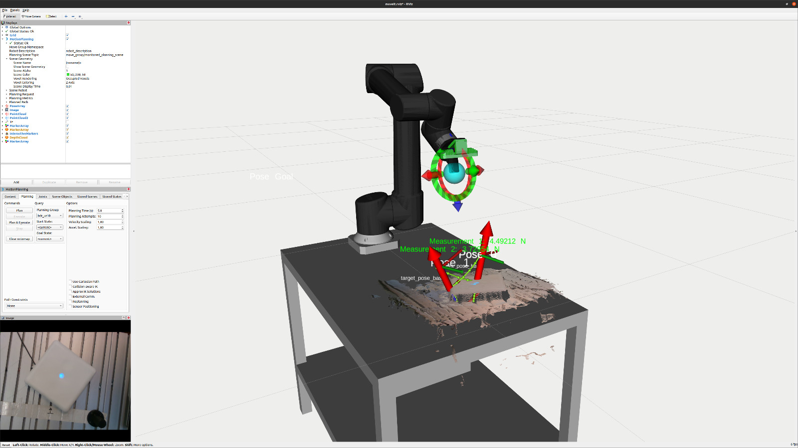
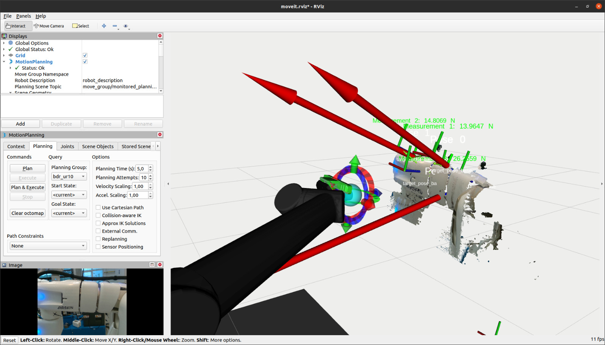
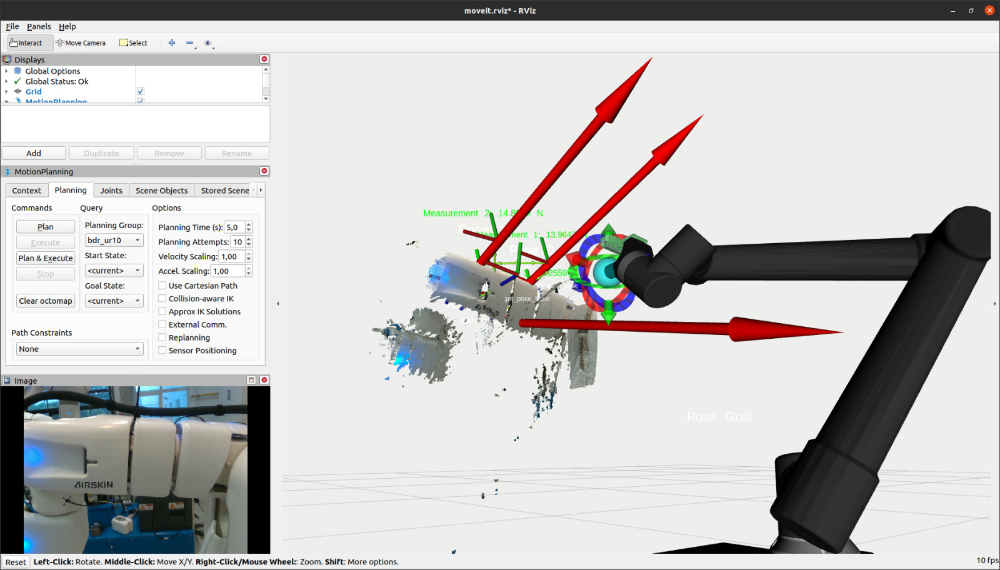
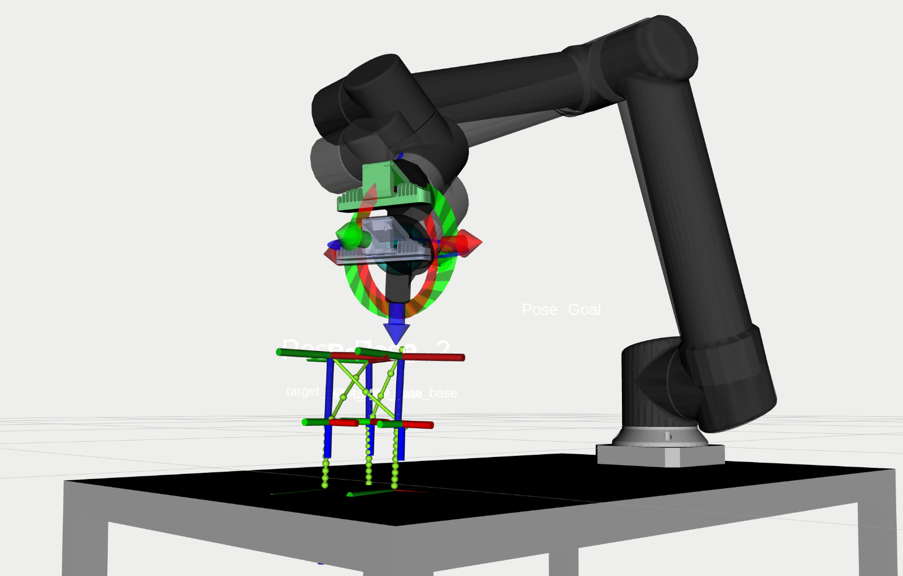

# Docker Installation Guide

## Docker Installation Documentation:
You can follow the official Docker installation documentation for Ubuntu by visiting the following link:  
[Docker Install Guide for Ubuntu](https://docs.docker.com/engine/install/ubuntu/#install-using-the-repository)

### Step-by-Step Installation:

1. Update your package list:
   ```bash
   sudo apt-get update
   ```

2. Install the required packages:
   ```bash
   sudo apt-get install ca-certificates curl
   ```

3. Add Docker's official GPG key:
   ```bash
   sudo install -m 0755 -d /etc/apt/keyrings
   sudo curl -fsSL https://download.docker.com/linux/ubuntu/gpg -o /etc/apt/keyrings/docker.asc
   sudo chmod a+r /etc/apt/keyrings/docker.asc
   ```

4. Add the Docker repository to your Apt sources:
   ```bash
   echo "deb [arch=$(dpkg --print-architecture) signed-by=/etc/apt/keyrings/docker.asc] https://download.docker.com/linux/ubuntu $(. /etc/os-release && echo "$VERSION_CODENAME") stable" | sudo tee /etc/apt/sources.list.d/docker.list > /dev/null
   ```

5. Update your package list again:
   ```bash
   sudo apt-get update
   ```

6. Install Docker:
   ```bash
   sudo apt-get install docker-ce docker-ce-cli containerd.io docker-buildx-plugin docker-compose-plugin
   ```

7. Verify Docker installation by running the hello-world container:
   ```bash
   sudo docker run hello-world
   ```

## Docker Post-Installation Steps:
After installing Docker, you can follow these post-installation steps:  
[Docker Post-Install Guide](https://docs.docker.com/engine/install/linux-postinstall/)

1. Create the Docker group:
   ```bash
   sudo groupadd docker
   ```

2. Add your user to the Docker group:
   ```bash
   sudo usermod -aG docker $USER
   ```

3. Log out and log back in for the changes to take effect.

4. Start a new shell session:
   ```bash
   newgrp docker
   ```

5. Verify Docker is working without `sudo`:
   ```bash
   docker run hello-world
   ```

6. Enable Docker services to start on boot:
   ```bash
   sudo systemctl enable docker.service
   sudo systemctl enable containerd.service
   ```

---


# Goldilocks Sensibility Measurements

The Goldilocks Sensibility Measurements refer to a precise and methodical process designed to assess the mechanical and sensory capabilities of the UR robot in real-world applications. This process leverages both hardware and software components to ensure the system operates within optimal performance thresholds. Below is a visual demonstration of the sensibility measurements in action:









## Process Overview

1. **Ethernet Setup**: Ensure the Ethernet cable is properly connected between the UR robot and the laptop.
2. **UR Initialization**: Power on the UR robot and ensure it is initialized properly.
3. **Robot IP Configuration**: Confirm the robot’s IP address is set to `192.168.1.102`.
3. **Laptop IP Configuration**: Confirm the Laptops’s IP address is set to `192.168.1.101`.
4. **Workspace Setup**: Open Visual Studio Code (VSC) and select the `goldilocks_sensibility_ws` workspace folder.
5. **Dependency Management**: Use either Docker (recommended) or install the necessary dependencies locally as specified in the Dockerfile. To install dependencies manually, run:
    ```bash
    rosdep install --from-paths src --ignore-src -y
    ```

## Running the Sensibility Measurement

Once the setup is complete, follow the steps below to run the sensibility measurement program:

1. **Launch ROSBridge Server**:
    Start the ROSBridge server for TCP communication between the laptop and the UR:
    ```bash
    roslaunch rosbridge_server rosbridge_tcp.launch
    ```
    This connects the laptop to the UR via TCP, allowing the force-torque sensor data to be published.

2. **Open HMI for Sensibility Control**:
    Launch the sensitivity measurement control interface:
    ```bash
    roslaunch tars_robot measure_sensitivity.launch
    ```
    The Human-Machine Interface (HMI) allows you to:
    - Enter **freedrive mode** to teach measurement points (`Setup` button).
    - Switch to **external control mode** to control the robot via MoveIt RViz (`Begin External Control` button).
    - Stop both programs and the TCP connection (`Default` button).

3. **Start Sensibility Measurement**:
    Once the measurement points are defined, start the sensibility measurement process:
    ```bash
    roslaunch tars_robot start_sensibility_measurement.launch
    ```
    You can adjust program parameters in the file:
    ```bash
    src/tars_robot/param/sensitivity_program_param.yaml
    ```

4. **Data and Plots**:
    The program will automatically save CSV files of the results in:
    ```bash
    src/tars_robot/data
    ```
    Python scripts will automatically generate plots for each measurement set if they do not exist. If a 3D visualization of the measurement is required, connect the camera to the laptop. Ensure the camera is connected via a powered USB hub if an extension cable is used.

    ```bash
    rosrun  tars_robot create_sensibility_plot.py
    ```

---

# Hardware Setup

The hardware setup for the Goldilocks Sensibility Measurements is crucial for obtaining accurate and reliable data. Below are the key components and configuration steps:

### Required Components

- **UR10 Robot**: The primary robotic platform used for manipulation and testing.
- **FT300 Force-Torque Sensor**: Provides precision measurements of applied forces and torques during the test.
- **Camera**: Mounted on the test finger gripper to capture visual data during the process.

### Pre-Configuration Checklist

1. **FT300 Sensor**: Ensure the FT300 sensor is securely connected to the UR10 robot via USB. The sensor provides crucial feedback for force and torque measurements.
2. **Camera Mounting**: The camera must be firmly mounted on the test finger gripper to capture relevant visual data.
3. **UR Software**: The UR10 should have **Polyscope** version 3.12.x or later installed to ensure compatibility with the measurement programs.
4. **ROS Setup**: ROS Noetic should be installed on the controlling machine (e.g., laptop) to allow for communication with the robot and sensor systems.

### Software Setup

1. **Catkin Workspace**: Navigate to your Catkin workspace and ensure the required packages are installed:
   ```bash
   cd ~/catkin_ws
   ```
2. **IP Configuration**: Confirm that the IP address of your laptop is set to `192.168.1.101`. This ensures proper communication with the UR robot.
3. **System Update & ROS Dependencies**:
   Ensure the system is updated and ROS dependencies are installed:
   ```bash
   sudo apt-get update
   rosdep install --from-paths src --ignore-src -y
   ```

This hardware and software configuration ensures the UR robot is prepared for accurate sensibility measurements and optimal interaction with both the physical environment and external control interfaces.

# UR Robot Startup Guide

## Preparation:

1. Navigate to your Catkin workspace:
   ```bash
   cd ~/catkin_ws
   ```

2. Ensure your laptop IP is configured correctly:
   ```bash
   Laptop IP = 192.168.1.101
   ```

3. Update the system and install necessary ROS dependencies:
   ```bash
   sudo apt-get update
   rosdep install --from-paths src --ignore-src -y
   rosdep install --from-paths src --ignore-src -r -y
   ```

## Launching the UR Robot:

1. Run the calibration correction launch file:
   ```bash
   roslaunch ur_calibration calibration_correction.launch robot_ip:=192.168.1.102 target_filename:="${HOME}/my_robot_calibration.yaml"
   ```

2. Bring up the UR10 robot with the driver:
   ```bash
   roslaunch ur_robot_driver ur10_bringup.launch robot_ip:=192.168.1.102 kinematics_config:=/home/kevin/catkin_ws/src/ur_calibration/ex-ur5_calibration.yaml
   ```

3. Start the MoveIt planning and execution:
   ```bash
   roslaunch ur10_moveit_config moveit_planning_execution.launch limited:=true
   ```

4. Launch the MoveIt Rviz interface:
   ```bash
   roslaunch ur10_moveit_config moveit_rviz.launch config:=true
   ```

---

# Camera Startup

Launch the RealSense camera and point cloud:
```bash
roslaunch realsense2_camera demo_pointcloud.launch
```

# Starting Program on Laptop

Launch ROSBridge Server for TCP communication:
```bash
roslaunch rosbridge_server rosbridge_tcp.launch
```

# Gazebo Simulation

To start the Gazebo simulation for the UR robot, run:
```bash
roslaunch tars_robot gazebo_sim.launch
```

# UR Robot Service Calls

1. Load a specific program on the UR robot:
   ```bash
   rosservice call /ur_hardware_interface/dashboard/load_program "{filename: '/programs/Sensitivity_Measurement/2024_07_29_External_Control.urp'}"
   ```

2. Start the loaded program:
   ```bash
   rosservice call /ur_hardware_interface/dashboard/play "{}"
   ```

3. Stop the running program:
   ```bash
   rosservice call /ur_hardware_interface/dashboard/stop "{}"
   ```

---

**Note:** These instructions are designed for a manual setup, but they can be automated by integrating them into a Dockerfile for ease of deployment in the future.